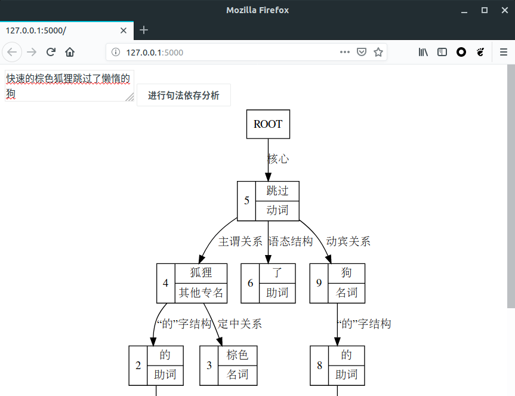

# baiduaip-nlp-pos-example

百度AI开放平台基础NLP `POS` 功能的简单小例子。



这个程序的 `Web` 服务程序使用 [Python][] 开发。

## 安装

1. 安装 [Python][]，强烈建议使用 `3.x` 的最新稳定版

1. 安装 [Node.js][]，建议的版本是最新的长期支持版

1. 下载项目代码，然后切换到项目的根目录:

   ```bash
   git https://github.com/tanbro/baiduaip-nlp-pos-example01.git
   cd baiduaip-nlp-pos-example01
   ```

1. 在 [Python][] [虚拟环境][venv] 中运行这个程序是最好不过的了 —— 建立目录名为 `venv` 的 [虚拟环境][venv] :

   ```bash
   python -m venv venv
   ```

   激活环境:

   - POSIX:

     ```bash
     source venv/bin/activate
     ```

   - Windows:

     ```batch
     venv/Scripts/Activate.bat
     ```

1. 安装这个 `Web` 程序所需的 [Python][] 包:

   ```bash
   pip install -r requirements.txt
   ```

1. 安装安装这个小 `Web` 程序所需的 [Node.js][] 包:

   ```bash
   npm install
   ```

## 配置

在目录中新建配置文件 `config.yml` , 其内容是：

```yaml
APP_ID: '百度云AI开放平台的 APP_ID'
API_KEY: '百度云AI开放平台的 API_KEY'
SECRET_KEY: '百度云AI开放平台的 SECRET_KEY'
```

## 运行

ℹ **提示**:

> 如果使用了虚拟环境，应首先激活。

以开发模式试运行:

```bash
export FLASK_APP=aipnlp.py
export FLASK_ENV=development
flask run
```

用浏览器访问 <http://localhost:5000/> ，输入一句中文试试看吧。

----

[Python]: https://python.org/
[venv]: https://docs.python.org/3/library/venv.html
[Node.js]: https://nodejs.org/
